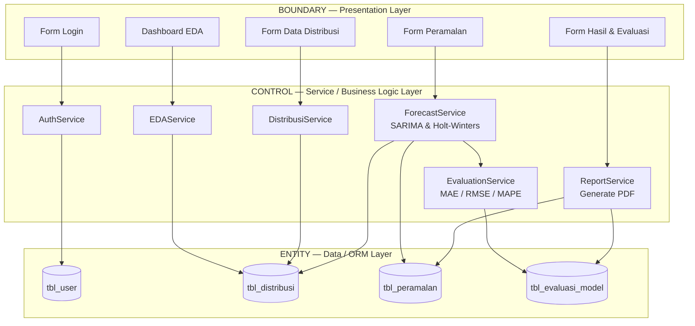
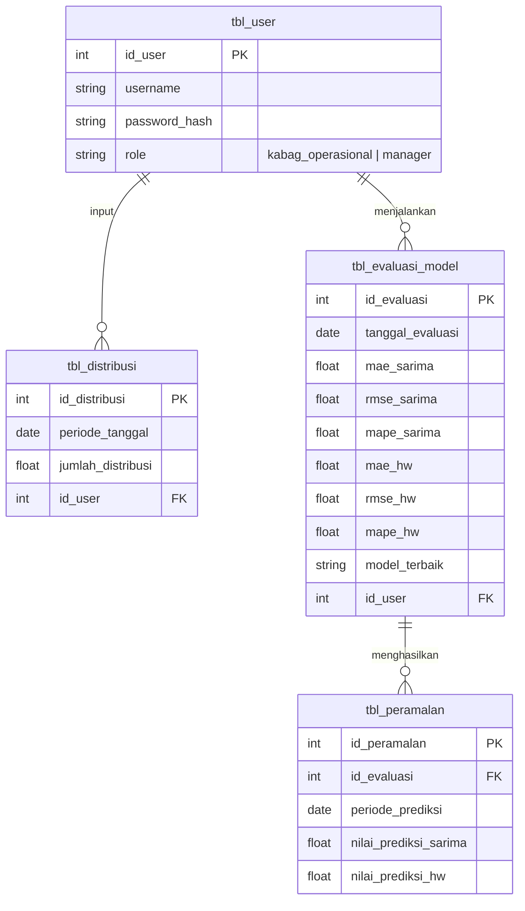
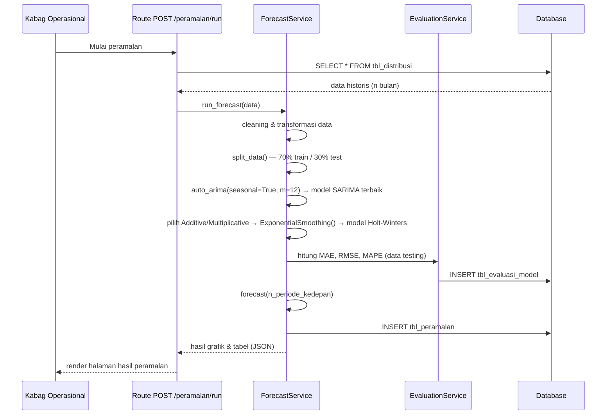

# Arsitektur Sistem Peramalan Distribusi LPG
### SPPBE PT Polly Jasa Persada Indramayu — Flask Implementation

> Dokumen ini diturunkan dari Bab II (Metodologi), Bab III (Landasan Teori), dan Bab IV
> (Analisis & Perancangan: Use Case, Activity, Sequence, Class Diagram, dan Wireframe)
> pada laporan skripsi. Tujuannya sebagai acuan teknis pengembangan sistem nyata
> berbasis Python (Flask).

---

## 1. Ringkasan Sistem

| Aspek | Keterangan |
|---|---|
| Tujuan sistem | Mengotomatisasi proses peramalan distribusi LPG bulanan menggunakan model SARIMA dan Holt-Winters Exponential Smoothing, serta menyajikan evaluasi & laporan perbandingan model |
| Aktor | **Kepala Bagian Operasional** (akses penuh: kelola data, jalankan peramalan, lihat evaluasi) dan **Manager** (akses pemantauan: dashboard, evaluasi, ekspor laporan) |
| Data utama | Data bulanan distribusi LPG 2020–2025 (72 observasi), input via Excel |
| Output utama | Grafik EDA, hasil prediksi SARIMA & Holt-Winters, metrik MAE/RMSE/MAPE, laporan PDF |

---

## 2. Tech Stack

| Layer | Teknologi |
|---|---|
| Web framework | Flask (Application Factory + Blueprint) |
| ORM / DB | SQLAlchemy + Flask-Migrate (Alembic), MySQL (sesuai Bab III.14.2) |
| Auth & Session | Flask-Login, Flask-WTF (CSRF & form validation) |
| Forecasting | `pmdarima` (Auto-ARIMA/SARIMA), `statsmodels` (Holt-Winters / ExponentialSmoothing), `pandas`, `numpy` |
| Evaluasi model | `scikit-learn.metrics` atau perhitungan manual (MAE, RMSE, MAPE) |
| Visualisasi | Chart.js (sisi client) — data dikirim sebagai JSON dari Flask |
| Import data | `pandas` + `openpyxl` (baca file Excel) |
| Export laporan | WeasyPrint atau ReportLab (generate PDF) |
| Frontend | Jinja2 templates + Bootstrap/Tailwind |

---

## 3. Gaya Arsitektur: Boundary–Control–Entity (BCE) → Flask

Class Diagram pada laporan (Gambar 4.30) sudah eksplisit memakai pendekatan BCE.
Pemetaan langsung ke struktur Flask:

| Layer BCE | Komponen pada Skripsi | Implementasi Flask |
|---|---|---|
| **Boundary** | `Form_Login`, `Form_Menu_Utama`, `Form_Dashboard`, `Form_DataDistribusi`, `Form_Peramalan`, `Form_HasilEvaluasi` | Templates (Jinja2) + View functions per Blueprint |
| **Control** | `Class_Autentikasi`, `Class_KelolaDistribusi`, `Class_AnalisaData`, `Class_Peramalan` | Service layer (`app/services/`) — logic murni, tidak bergantung pada objek `request` Flask agar mudah di-unit test |
| **Entity** | `tbl_user`, `tbl_distribusi`, `tbl_peramalan`, `tbl_evaluasi_model` | SQLAlchemy Models (`app/models/`) |



---

## 4. Struktur Folder Proyek

```
lpg_forecast_app/
├── app/
│   ├── __init__.py                  # Application factory (create_app)
│   ├── extensions.py                # db, login_manager, migrate
│   ├── config.py                    # Config dev/prod, DB URI, SECRET_KEY
│   │
│   ├── models/                      # ===== ENTITY LAYER =====
│   │   ├── __init__.py
│   │   ├── user.py                  # tbl_user
│   │   ├── distribusi.py            # tbl_distribusi
│   │   ├── peramalan.py             # tbl_peramalan
│   │   └── evaluasi_model.py        # tbl_evaluasi_model
│   │
│   ├── services/                    # ===== CONTROL LAYER =====
│   │   ├── __init__.py
│   │   ├── auth_service.py          # Class_Autentikasi
│   │   ├── distribusi_service.py    # Class_KelolaDistribusi
│   │   ├── eda_service.py           # Class_AnalisaData
│   │   ├── forecast_service.py      # Class_Peramalan (SARIMA + Holt-Winters)
│   │   ├── evaluation_service.py    # Hitung MAE, RMSE, MAPE
│   │   └── report_service.py        # Generate laporan PDF
│   │
│   ├── blueprints/                  # ===== BOUNDARY LAYER (routes) =====
│   │   ├── auth/
│   │   │   ├── __init__.py
│   │   │   └── routes.py            # /login, /logout
│   │   ├── dashboard/
│   │   │   ├── __init__.py
│   │   │   └── routes.py            # /dashboard
│   │   ├── distribusi/
│   │   │   ├── __init__.py
│   │   │   └── routes.py            # /distribusi (import, hapus, list)
│   │   ├── peramalan/
│   │   │   ├── __init__.py
│   │   │   └── routes.py            # /peramalan/run
│   │   └── evaluasi/
│   │       ├── __init__.py
│   │       └── routes.py            # /evaluasi, /evaluasi/export-pdf
│   │
│   ├── templates/
│   │   ├── base.html
│   │   ├── auth/login.html
│   │   ├── dashboard/index.html       # beda tampilan per role (Jinja condition)
│   │   ├── distribusi/index.html
│   │   ├── peramalan/index.html
│   │   └── evaluasi/index.html
│   │
│   ├── static/
│   │   ├── css/
│   │   └── js/
│   │       └── charts.js              # render grafik EDA, prediksi, perbandingan
│   │
│   └── utils/
│       ├── decorators.py              # @role_required('manager' | 'kabag_operasional')
│       └── validators.py              # validasi format file excel
│
├── migrations/                       # Flask-Migrate (Alembic)
├── tests/
│   ├── test_forecast_service.py
│   └── test_evaluation_service.py
├── wsgi.py
├── requirements.txt
└── .env
```

---

## 5. Skema Basis Data (ERD)

Diturunkan langsung dari entity class diagram (`tbl_user`, `tbl_distribusi`,
`tbl_peramalan`, `tbl_evaluasi_model`):



> Catatan: `password_hash` (bukan plain text seperti tersirat di class diagram)
> — gunakan `werkzeug.security.generate_password_hash`.

---

## 6. Pemetaan Use Case → Endpoint → Service

| Use Case (Bab IV.4.4.1) | Aktor | Route | Service yang dipanggil |
|---|---|---|---|
| Login | Kabag Operasional, Manager | `POST /login` | `AuthService.validate_user()` |
| Logout | Kabag Operasional, Manager | `GET /logout` | `AuthService.logout_session()` |
| Dashboard / EDA | Keduanya | `GET /dashboard` | `EDAService.get_decomposition()`, `get_statistik_deskriptif()` |
| Import Data Distribusi | Kabag Operasional | `POST /distribusi/import` | `DistribusiService.baca_file_excel()` → `validasi_format_data()` → `simpan_ke_database()` |
| Hapus Data per Periode | Kabag Operasional | `POST /distribusi/delete/<periode>` | `DistribusiService.delete_data()` |
| Proses Peramalan | Kabag Operasional | `POST /peramalan/run` | `ForecastService.split_data()` → `eksekusi_sarima()` → `eksekusi_holt_winters()` |
| Hasil & Evaluasi Model | Keduanya | `GET /evaluasi` | `EvaluationService.get_evaluasi_terbaru()` |
| Grafik Perbandingan Metode | Keduanya | `GET /evaluasi/compare` | `ForecastService` + `EvaluationService` |
| Export Laporan Prediksi | Keduanya | `GET /evaluasi/export-pdf` | `ReportService.generate_laporan_pdf()` |

---

## 7. Forecasting Pipeline (`ForecastService` / `Class_Peramalan`)

Mengikuti urutan pada Sequence Diagram Proses Peramalan (Gambar 4.28):



### Keputusan desain penting: auto-tuning, bukan parameter statis

Bab IV.3.4 menetapkan model manual hasil EViews (mis. SARIMA(0,1,0)(0,1,0)₁₂),
tetapi catatan draft di Bab IV.3.6 menyatakan tujuan sistem adalah **peramalan
yang adaptif & terotomatisasi**. Arsitektur ini mengikuti rasional tersebut:

```python
# forecast_service.py (ringkas)
from pmdarima import auto_arima
from statsmodels.tsa.holtwinters import ExponentialSmoothing

def eksekusi_sarima(train, test, m=12):
    model = auto_arima(
        train, seasonal=True, m=m,
        suppress_warnings=True, stepwise=True
    )
    forecast = model.predict(n_periods=len(test))
    return model, forecast

def eksekusi_holt_winters(train, test, m=12):
    # deteksi additive vs multiplicative berdasarkan
    # konsistensi amplitudo musiman (lihat EDAService.get_decomposition)
    seasonal_type = "add"  # atau "mul", hasil dari EDAService
    model = ExponentialSmoothing(
        train, trend="add", seasonal=seasonal_type, seasonal_periods=m
    ).fit()
    forecast = model.forecast(len(test))
    return model, forecast
```

Implikasi: setiap kali Kabag Operasional menambah data baru, sistem
**melatih ulang model dari nol** (bukan memuat parameter statis lama),
sesuai functional requirement #4–#5 (Bab IV.2.3) yang meminta sistem mampu
menjalankan ulang proses peramalan secara mandiri.

> ⚠️ **Perlu konfirmasi dari kamu**: apakah sistem akhir benar-benar harus
> auto-tuning seperti ini, atau justru harus mereproduksi persis model statis
> SARIMA(0,1,0)(0,1,0)₁₂ dan parameter Holt-Winters (α=0,348; β=γ=0) yang
> dilaporkan di Tabel 4.9/4.10 untuk keperluan validasi terhadap hasil skripsi?
> Kedua pendekatan punya implikasi berbeda terhadap MAPE yang akan dihasilkan
> sistem saat demo/sidang.

---

## 8. Role-Based Access Control

Sesuai Use Case Diagram Manager (Gambar 4.22) yang **tidak** memiliki akses
ke "Kelola Data Distribusi" maupun "Proses Peramalan":

```python
# utils/decorators.py
from functools import wraps
from flask_login import current_user
from flask import abort

def role_required(*roles):
    def decorator(f):
        @wraps(f)
        def wrapped(*args, **kwargs):
            if current_user.role not in roles:
                abort(403)
            return f(*args, **kwargs)
        return wrapped
    return decorator
```

| Endpoint | Kabag Operasional | Manager |
|---|---|---|
| `/dashboard` | ✅ | ✅ |
| `/distribusi/*` (import, hapus) | ✅ | ❌ |
| `/peramalan/run` | ✅ | ❌ |
| `/evaluasi`, `/evaluasi/compare` | ✅ | ✅ (read-only) |
| `/evaluasi/export-pdf` | ✅ | ✅ |

---

## 9. Validasi Konsistensi dengan Laporan (Checklist)

Sebelum implementasi dijadikan acuan final, selaraskan dulu hal-hal berikut
di laporan agar sistem dan dokumen tidak bertentangan saat sidang:

- [ ] Samakan angka final evaluasi SARIMA vs Holt-Winters (Tabel 4.9/4.12/4.14
      vs paragraf naratif setelah Tabel 4.14 — saat ini berbeda)
- [ ] Putuskan notasi model SARIMA final: (0,1,0)(0,1,0)₁₂ **atau**
      (2,1,0)(1,0,0)₁₂ — jangan dipakai bergantian tanpa penjelasan
- [ ] Hapus/selesaikan comment draft Word (`[lj1]`, `[lj2]`) dari body teks
- [ ] Update field cross-reference gambar yang rusak (*Error! Bookmark not
      defined.*) — Select All → F9 di Word
- [ ] Perbaiki penomoran caption salah bab (Gambar "3.21" → "4.21", "3.30" → "4.30")
- [ ] Pastikan pilihan auto-tuning vs parameter statis (lihat §7) konsisten
      antara narasi skripsi dan implementasi sistem

---

## 10. Dependencies (`requirements.txt`)

```
Flask>=3.0
Flask-SQLAlchemy
Flask-Migrate
Flask-Login
Flask-WTF
PyMySQL
pandas
numpy
pmdarima
statsmodels
scikit-learn
openpyxl
WeasyPrint
python-dotenv
```
